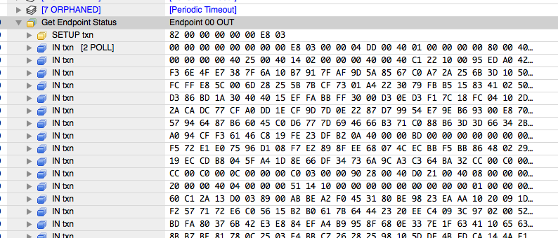
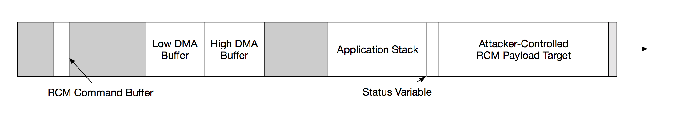
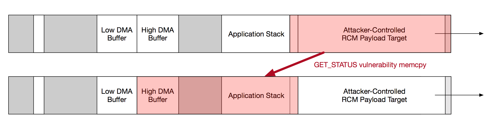
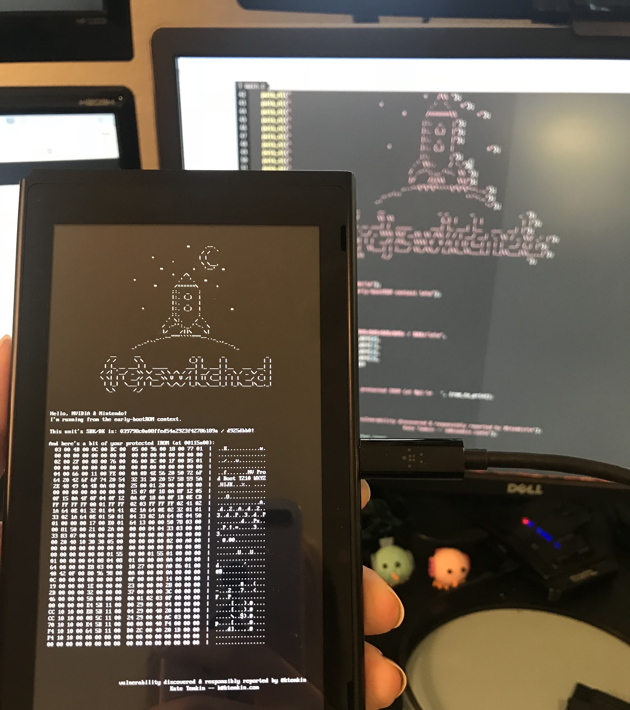

## Vulnerability Disclosure: Fusée Gelée

This report documents Fusée Gelée, a coldboot vulnerability that allows full,
unauthenticated arbitrary code execution from an early bootROM context via Tegra
Recovery Mode (RCM) on NVIDIA's Tegra line of embedded processors.  As this
vulnerability allows arbitrary code execution on the Boot and Power Management
Processor (BPMP) before any lock-outs take effect, this vulnerability compromises
the entire root-of-trust for each processor, and allows exfiltration of secrets
e.g. burned into device fuses.

 Quick vitals: &nbsp; &nbsp; &nbsp; &nbsp; &nbsp; &nbsp; &nbsp; &nbsp; &nbsp; &nbsp;   | |
--------------------|--------------------------------------------------------
 *Reporter:*      | Katherine Temkin (@ktemkin)
 *Affiliation:*   | ReSwitched (https://reswitched.tech)
 *E-mail:*        | k@ktemkin.com
 *Affects:*       | Tegra SoCs, independent of software stack
 *Versions:*      | believed to affect Tegra SoCs released prior to the T186 / X2
 *Impact:*        | early bootROM code execution with no software requirements, which can lead to full compromise of on-device secrets where USB access is possible
 *Disclosure*     | public disclosure planned for June 15th, 2018

#### Vulnerability Summary

The USB software stack provided inside the boot instruction rom (IROM/bootROM)
contains a copy operation whose length can be controlled by an attacker. By
carefully constructing a USB control request, an attacker can leverage this
vulnerability to copy the contents of an attacker-controlled buffer over the
active execution stack, gaining control of the Boot and Power Management
processor (BPMP) before any lock-outs or privilege reductions occur. This
execution can then be used to exfiltrate secrets and to load arbitrary code onto
the main CPU Complex (CCPLEX) "application processors" at the highest possible
level of privilege (typically as the TrustZone Secure Monitor at PL3/EL3).


#### Public Disclosure Notice

This vulnerability is notable due to the significant number and variety of
devices affected, the severity of the issue, and the immutability of the relevant
code on devices already delivered to end users. This vulnerability report
is provided as a courtesy to help aid remediation efforts, guide communication,
and minimize impact to users.

As other groups appear to have this or an equivalent exploit--
[including a group who claims they will be selling access to an implementation of such an exploit](http://team-xecuter.com/team-xecuter-coming-to-your-nintendo-switch-console/)--
it is the author and the ReSwitched team's belief that prompt public disclosure
best serves the public interest. By minimizing the information asymmetry between
the general public and exploit-holders and notifying the public, users will be
able to best assess how this vulnerability impacts their personal threat models.

Accordingly, ReSwitched anticipates public disclosure of this vulnerability:
  * If another group releases an implementation of the identified
     vulnerability; or
  * On June 15th, 2018, whichever comes first.

### Vulnerability Details

The core of the Tegra boot process is approximated by the following block of
pseudo-code, as obtained by reverse-engineering an IROM extracted from a
vulnerable T210 system:

```C
// If this is a warmboot (from "sleep"), restore the saved state from RAM.
if (read_scratch0_bit(1)) {
  restore_warmboot_image(&load_addr);
}
// Otherwise, bootstrap the processor.
else
{
  // Allow recovery mode to be forced by a PMC scratch bit or physical straps.
  force_recovery = check_for_rcm_straps() || read_scratch0_bit(2);

  // Determine whether to use USB2 or USB3 for RCM.
  determine_rcm_usb_version(&usb_version);
  usb_ops = set_up_usb_ops(usb_version);
  usb_ops->initialize();

  // If we're not forcing recovery, attempt to load an image from boot media.
  if (!force_recovery)
  {
    // If we succeeded, don't fall back into recovery mode.
    if (read_boot_configuration_and_images(&load_addr) == SUCCESS) {
      goto boot_complete;
    }
  }

  // In all other conditions
  if (read_boot_images_via_usb_rcm(<snip>, &load_addr) != SUCCESS) {
     /* load address is poisoned here */
  }
}

boot_complete:
  /* apply lock-outs, and boot the program at address load_address  */
```

Tegra processors include a USB Recovery Mode (RCM), which we can observe to be activated under a number of conditions:
  * If the processor fails to find a valid Boot Control Table (BCT) + bootloader on its boot media;
  * If processor straps are pulled to a particular value e.g. by holding a button combination; or
  * If the processor is rebooted after a particular value is written into a power management controller scratch register.

USB recovery mode is present in all devices, including devices that have been
production secured. To ensure that USB recovery mode does not allow unauthenticated
communications, RCM requires all recovery commands be signed using either RSA
or via AES-CMAC.

The bootloader's implementation of the Tegra RCM protocol is simple, and exists
to allow loading a small piece of code (called the *miniloader* or *applet*) into
the bootloader's local Instruction RAM (IRAM). In a typical application, this
*applet* is `nvtboot-recovery`, a stub which allows further USB communications to
bootstrap a system or to allow system provisioning.

The RCM process is approximated by the following pseudo-code, again obtained via
reverse engineering a dumped IROM from a T210:

```C
// Significantly simplified for clarity, with error checking omitted where unimportant.
while (1) {
  // Repeatedly handle USB standard events on the control endpoint EP0.
  usb_ops->handle_control_requests(current_dma_buffer);

  // Try to send the device ID over the main USB data pipe until we succeed.
  if ( rcm_send_device_id() == USB_NOT_CONFIGURED ) {
    usb_initialized = 0;
  }
  // Once we've made a USB connection, accept RCM commands on EP1.
  else {
    usb_initialized = 1;

    // Read a full RCM command and any associated payload into a global buffer.
    // (Error checking omitted for brevity.)
    rcm_read_command_and_payload();

    // Validate the received RCM command; e.g. by checking for signatures
    // in RSA or AES_CMAC mode, or by trivially succeeding if we're not in
    // a secure mode.
    rc = rcm_validate_command();
    if (rc != VALIDATION_PASS) {
      return rc;
    }

    // Handle the received and validated command.
    // For a "load miniloader" command, this sanity checks the (validated)
    // miniloader image and takes steps to prevent re-use of signed data not
    // intended to be used as an RCM command.
    rcm_handle_command_complete(...);
  }
}
```

It is important to note that a full RCM command *and its associated payload*
are read into 1) a global buffer, and 2) the target load address, respectively,
before any signature checking is done. This effectively grants the attacker a
narrow window in which they control a large region of unvalidated memory.

The largest vulnerability surface area occurs in the `rcm_read_command_and_payload`
function, which accepts the RCM command and payload packets via a USB bulk endpoint.
For our purposes, this endpoint is essentially a simple pipe for conveyance
of blocks of binary data separate from standard USB communications.

The `rcm_read_command_and_payload` function actually contains several issues--
of which exactly one is known to be exploitable:

```C
uint32_t total_rxd  = 0;
uint32_t total_to_rx = 0x400;

// Loop until we've received our full command and payload.
while (total_rxd < total_to_rx) {
  // Switch between two DMA buffers, so the USB is never DMA'ing into the same
  // buffer that we're processing.
  active_buffer = next_buffer;
  next_buffer   = switch_dma_buffers();

  // Start a USB DMA transaction on the RCM bulk endpoint, which will hopefully
  // receive data from the host in the background as we copy.
  usb_ops->start_nonblocking_bulk_read(active_buffer, 0x1000);

  // If we're in the first 680-bytes we're receiving, this is part of the RCM
  // command, and we should read it into the command buffer.
  if ( total_rxd < 680 ) {
    /* copy data from the DMA buffer into the RCM command buffer until we've
       read a full 680-byte RCM command */

    // Once we've received the first four bytes of the RCM command,
    // use that to figure out how much data should be received.
    if ( total_rxd >= 4 )
    {
      // validate:
      //  -- the command won't exceed our total RAM
      //     (680 here, 0x30000 in upper IRAM)
      //  -- the command is >= 0x400 bytes
      //  -- the size ends in 8
      if ( rcm_command_buffer[0] >= 0x302A8u
              || rcm_command_buffer[0] < 0x400u
              || (rcm_command_buffer[0] & 0xF) != 8 ) {
        return ERROR_INVALID_SIZE;
      } else  {
        left_to_rx = *((uint32_t *)rcm_command_buffer);
      }
    }
  }

  /* copy any data _past_ the command into a separate payload
     buffer at 0x40010000 */
  /* -code omitted for brevity - */

  // Wait for the DMA transaction to complete.
  // [This is, again, simplified to convey concepts.]
  while(!usb_ops->bulk_read_complete()) {

    // While we're blocking, it's still important that we respond to standard
    // USB packets on the control endpoint, so do that here.
    usb_ops->handle_control_requests(next_buffer);
  }
}
```

Astute readers will notice an issue unrelated to the Fusée Gelée exploit: this
code fails to properly ensure DMA buffers are being used exclusively for a single
operation. This results in an interesting race condition in which a DMA buffer
can be simultaneously used to handle a control request and a RCM bulk transfer.
This can break the flow of RCM, but as both operations contain untrusted data,
this issue poses no security risk.

To find the actual vulnerability, we must delve deeper, into the code that handles
standard USB control requests. The core of this code is responsible for responding
to USB control requests. A *control request* is initiated when the host sends a
setup packet, of the following form:

Field     | &nbsp; &nbsp; &nbsp; &nbsp; Size  &nbsp; &nbsp;| Description
----------|:----:|-----
direction | 1b   | if '1', the device should respond with data
type      | 2b   | specifies whether this request is of a standard type or not
recipient | 5b   | encodes the context in which this request should be considered; <br /> for example, is this about a `DEVICE` or about an `ENDPOINT`?
request   | 8b   | specifies the request number
value     | 16b  | argument to the request
index     | 16b  | argument to the request
length    | 16b  | specifies the maximum amount of data to be transferred

As an example, the host can request the status of a device by issuing a
`GET_STATUS` request, at which point the device would be expected to respond with
a short setup packet. Of particular note is the `length` field of the request,
which should *limit* -- but not exclusively determine-- the *maximum* amount of
data that should be included in the response. Per the specification, the device
should respond with either the *amount of data specified* or the *amount of data
available*, whichever is less.

The bootloader's implementation of this behavior is conceptually implemented as
follows:

```C

// Temporary, automatic variables, located on the stack.
uint16_t status;
void *data_to_tx;

// The amount of data available to transmit.
uint16_t size_to_tx   = 0;

 // The amount of data the USB host requested.
uint16_t length_read  = setup_packet.length;

/* Lots of handler cases have omitted for brevity. */

// Handle GET_STATUS requests.
if (setup_packet.request == REQUEST_GET_STATUS)
{
  // If this is asking for the DEVICE's status, respond accordingly.
  if(setup_packet.recipient == RECIPIENT_DEVICE) {
      status     = get_usb_device_status();
      size_to_tx = sizeof(status);
  }
  // Otherwise, respond with the ENDPOINT status.
  else if (setup_packet.recipient == RECIPIENT_ENDPOINT){
      status     = get_usb_endpoint_status(setup_packet.index);
      size_to_tx = length_read; // <-- This is a critical error!
  }
  else {
    /* ... */
  }

  // Send the status value, which we'll copy from the stack variable 'status'.
  data_to_tx = &status;
}

// Copy the data we have into our DMA buffer for transmission.
// For a GET_STATUS request, this copies data from the stack into our DMA buffer.
memcpy(dma_buffer, data_to_tx, size_to_tx);

// If the host requested less data than we have, only send the amount requested.
// This effectively selects min(size_to_tx, length_read).
if (length_read < size_to_tx) {
  size_to_tx = length_read;
}

// Transmit the response we've constructed back to the host.
respond_to_control_request(dma_buffer, length_to_send);
```

In most cases, the handler correctly limits the length of the transmitted
responses to the amount it has available, per the USB specification. However,
in a few notable cases, the length is *incorrectly always set to the amount
requested* by the host:
  * When issuing a `GET_CONFIGURATION` request with a `DEVICE` recipient.
  * When issuing a `GET_INTERFACE` request with a `INTERFACE` recipient.
  * When issuing a `GET_STATUS` request with a `ENDPOINT` recipient.

This is a critical security error, as the host can request up to 65,535 bytes per
control request. In cases where this is loaded directly into `size_to_tx`, this
value directly sets the extent of the `memcpy` that follows-- and thus can copy
up to 65,535 bytes into the currently selected `dma_buffer`. As the DMA buffers
used for the USB stack are each comparatively short, this can result in a _very_
significant buffer overflow.

To validate that the vulnerability is present on a given device, one can try
issuing an oversized request and watch as the device responds. Pictured below is
the response generated when sending a oversized `GET_STATUS` control request
with an `ENDPOINT` recipient to a T124:



A compliant device should generate a two-byte response to a `GET_STATUS` request--
but the affected Tegra responds with significantly longer response. This is a clear
indication that we've run into the vulnerability described above.

To really understand the impact of this vulnerability, it helps to understand
the memory layout used by the bootROM. For our proof-of-concept, we'll consider
the layout used by the T210 variant of the affected bootROM:



The major memory regions relevant to this vulnerability are as follows:
  * The bootROM's *execution stack* grows downward from `0x40010000`; so the
    execution stack is located in the memory *immediately preceding* that address.
  * The DMA buffers used for USB are located at `0x40005000` and `0x40009000`,
    respectively. Because the USB stack alternates between these two buffers
    once per USB transfer, the host effectively can control which DMA buffer
    is in use by sending USB transfers.
  * Once the bootloader's RCM code receives a 680-byte command, it begins to store
    received data in a section of upper IRAM located at address `0x40010000`, and can
    store up to `0x30000` bytes of payload. This address is notable, as it is immediately
    past the end of the active execution stack.

Of particular note is the adjacency of the bootROM's *execution stack* and the
attacker-controlled *RCM payload*. Consider the behavior of the previous pseudo-code
segment on receipt of a `GET_STATUS` request to the `ENDPOINT` with an
excessive length. The resulting memcpy:
  * copies *up to* 65,535 bytes total;
  * sources data from a region *starting at the status variable on the stack*
    and extending significantly past the stack -- effectively copying mostly
    *from the attacker-controllable RCM payload buffer*
  * targets a buffer starting either `0x40005000` or `0x40009000`, at the
    attacker's discretion, reaching addresses of up to `0x40014fff` or `0x40018fff`

This is a powerful copy primitive, as it copies *from attacker controlled memory*
and into a region that *includes the entire execution stack*:



This would be a powerful exploit on any platform; but this is a particularly devastating
attack in the bootROM environment, which does not:
  * Use common attack mitigations such as stack canaries, ostensibly to reduce
    complexity and save limited IRAM and IROM space.
  * Apply memory protections, so the entire stack and all attacker
    controlled buffers can be read from, written to, and executed from.
  * Employ typical 'application-processor' mitigation strategies such as ASLR.

Accordingly, we now have:
  1. The capability to load arbitrary payloads into memory via RCM, as RCM only
     validates command signatures once payload receipt is complete.
  2. The ability to copy attacker-controlled values over the execution stack,
     overwriting return addresses and redirecting execution to a location of our
     choice.

Together, these two abilities give us a full arbitrary-code execution exploit at
a critical point in the Tegra's start-up process. As control flow is hijacked
before return from `read_boot_images_via_usb_rcm`, none of the "lock-out"
operations that precede normal startup are executed. This means, for example,
that the T210 fuses-- and the keydata stored within them-- are accessible from
the attack payload, and the bootROM is not yet protected.

#### Exploit Execution

The Fusée Launcher PoC exploits the vulnerability described on the T210 via a
careful sequence of interactions:
  1. The device is started in RCM mode. Device specifics will differ, but this
     is often via a key-combination held on startup.
  2. A host computer is allowed to enumerate the RCM device normally.
  3. The host reads the RCM device's ID by reading 16 bytes from the EP1 IN.
  4. The host builds an exploit payload, which is comprised of:
      1. An RCM command that includes a maximum length, ensuring that we can send
         as much payload as possible without completing receipt of the RCM payload.
         Only the length of this command is used prior to validation; so we can
         submit an RCM command that starts with a maximum length of 0x30298, but
         which fills the remaining 676 bytes of the RCM command with any value.
      2. A set of values with which to overwrite the stack. As stack return address
         locations vary across the series, it's recommended that a large block
         composed of a single entry-point address be repeated a significant number
         of times, so one can effectively replace the entire stack with that address.
      3. The program to be executed ("final payload") is appended, ensuring that its
         position in the binary matches the entry-point from the previous step.
      4. The payload is padded to be evenly divisible by the 0x1000 block size to
         ensure the active block is not overwritten by the "DMA dual-use" bug
         described above.
  5. The exploit payload is sent to the device over EP1 OUT, tracking the number of
     0x1000-byte "blocks" that have been sent to the device. If this number is _even_,
     the next write will be issued to the lower DMA buffer (`0x40005000`); otherwise,
     it will be issued to the upper DMA buffer (`0x40009000`).
  6. If the next write would target the lower DMA buffer, issue another write
     of a full 0x1000 bytes to move the target to the upper DMA buffer, reducing
     the total amount of data to be copied.
  7. Trigger the vulnerable memcpy by sending a `GET_STATUS` `IN` control
     request with an `ENDPOINT` recipient, and a length long enough to smash the
     desired stack region, and preferably not longer than required.

A simple host program that triggers this vulnerability is included with this
report: see `fusee-launcher.py`. Note the restrictions on its function in the
following section.


### Proof of Concept

Included with this report is a set of three files:
  * `fusee-launcher.py` -- The main proof-of-concept accompanying this report.
    This python script is designed to launch a simple binary payload in the
    described bootROM context via the exploit.
  * `intermezzo.bin` -- This small stub is designed to relocate a payload from
    a higher load address to the standard RCM load address of `0x40010000`. This
    allows standard RCM payloads (such as `nvtboot-recover.bin`) to be executed.
  * `fusee.bin` -- An example payload for the Nintendo Switch, a representative
    and well-secured device based on a T210. This payload will print information
    from the device's fuses and protected IROM to the display, demonstrating that
    early bootROM execution has been achieved.

**Support note:** Many host-OS driver stacks are reluctant to issue unreasonably
large control requests. Accordingly, the current proof-of-concept includes code
designed to work in the following environments:
  * **64-bit linux via `xhci_hcd`**. The proof-of-concept can manually submit
    large control requests, but does not work with the common `ehci_hcd` drivers
    due to driver limitations. A rough rule of thumb is that a connection via a
    blue / USB3 SuperSpeed port will almost always be handled by `xhci_hcd`.
  * **macOS**. The exploit works out of the box with no surprises or restrictions
    on modern macOS.

Windows support would require addition of a custom kernel module, and thus was
beyond the scope of a simple proof-of-concept.

To use this proof-of-concept on a Nintendo Switch:
  1. Set up an Linux or macOS environment that meets the criteria above, and
     which has a working `python3` and `pyusb` installed.
  2. Connect the Switch to your host PC with a USB A -> USB C cable.
  3. Boot the Switch in RCM mode. There are three ways to do this, but the first--
     unseating its eMMC board-- is likely the most straightforward:
      1. Ensure the Switch cannot boot off its eMMC. The most straightforward way to
         to this is to open the back cover and remove the socketed eMMC board; corrupting
         the BCT or bootloader on the eMMC boot partition would also work.
      2. Trigger the RCM straps. Hold VOL_UP and short pin 10 on the right
         JoyCon connector to ground while engaging the power button.
      3. Set bit 2 of PMC scratch register zero. On modern firmwares, this requires
         EL3 or pre-sleep BPMP execution.
  4. Run the `fusee-launcher.py` with an argument of `fusee.bin`. (This requires
     `intermezzo.bin` to be located in the same folder as `fusee-launcher.py`.)

    ```
    sudo python3 ./fusee-launcher.py fusee.bin
    ```

If everything functions correctly, your Switch should be displaying a collection
of fuse and protected-IROM information:




### Recommended Mitigations

In this case, the recommended mitigation is to correct the USB control request
handler such that it always correctly constrains the length to be transmitted.
This has to be handled according to the type of device:
  * **For a device already in consumer hands**, no solution is proposed.
    Unfortunately, access to the fuses needed to configure the device's ipatches
    was blocked when the ODM_PRODUCTION fuse was burned, so no bootROM update
    is possible. It is suggested that consumers be made aware of the situation
    so they can move to other devices, where possible.
  * **For new devices**, the correct solution is likely to introduce an
    new ipatch or new ipatches that limits the size of control request responses.

It seems likely that OEMs producing T210-based devices may move to T214 solutions;
it is the hope of the author that the T214's bootROM shares immunity with
the T186. If not, patching the above is a recommended modification to the mask ROM
and/or ipatches of the T214, as well.
